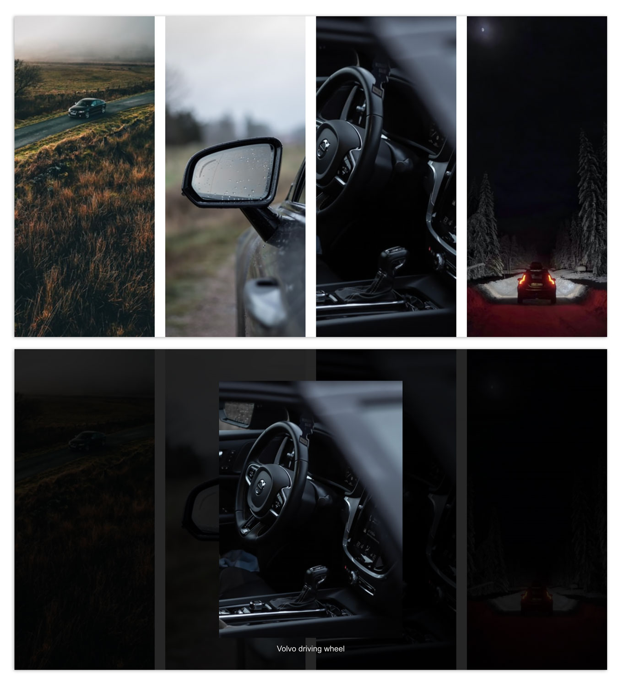

# MODAL WINDOW example

This is an example made following the [tutorial by Dev Ed](https://www.youtube.com/watch?v=4SQXOA8Z-lo).

---

## Technologies

- HTML
- CSS
- "vanilla" JavaScript

---

## Features

- images scale with window size
- images animate when hovering with mouse over them
- when clicking on an image, modal opens with dyinamical change of the image and its caption
- when clicking on the background, the modal is closed and the main page can be seen

---

## Visual

 

  

   

---

## Try it

[GitHub Pages](https://emarekica.github.io/modal-images/)

---

### Resources

- [Unsplash](https://unsplash.com/s/photos/volvo)

- [Dev Ed Youtube Channel](https://www.youtube.com/watch?v=4SQXOA8Z-lo)
